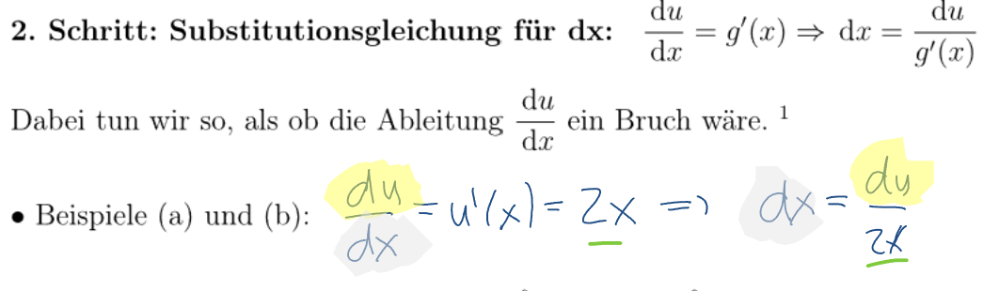

---
title:  'Analysis 2'
author:
- Manuel Strenge
keywords: [ANA 2, pain]
...

Gebiet                  Problemstellung     math. Grundlagen
----------              ------------        ----------
Simlulationen           Haare               Differentialgleichungen
Comp. Grafik            2D render Tasse     Integralrechnung
Scientific Computing    Daten ana           Taylor-Reihen

# Integrationsmethoden

*Einsatzgebiet: modelieren: z.B. $v(t)=t^2$*

Im Allgemeinen: $\int u(x) \cdot v(x) dx \neq \int u(x) dx \cdot \int v(x) dx$ 

**Repetition:**

Produktregel: $(u(x)\cdot v(x))' = u'(x) \cdot v(x) + u(x) \cdot v'(x)$

Kettenregel: $(F(u(x)))'=F'(x) \cdot u'(x)$

## Integration durch Substitution

Diese Integrationsmethode beruht auf der Kettenregel für die Ableitung:

$(F(u(x))) = \int (F(u(x)))' dx = \int F'(x) \cdot u'(x) dx$

1. Schritt: Substitutionsgleichung für $x: u = g(x)$

$u(x) = x^2$

2. Schritt: Substitutionsgleichung für dx:

3. Schritt: Integralsubstitution: $\int f(x) \mathrm{d} x=\int \varphi(u) \mathrm{d} u$

Wir ersetzen nun im Integral $g(x)$ und $dx$ gemäss den Substitutionsgleichungen. In dem resultierenden Integral kommen dann beide Variablen $x$ und $u$ vor; es ist somit streng genommen
gar nicht wohldefiniert.
Die Variable $x$ muss nun durch Kürzen zum Verschwinden gebracht werden!
Ist dies nicht möglich, so haben wir den falschen Ansatz gewählt.

$$\int \cos \left(x^2\right) \cdot x d x-\int \cos (u) \cdot x \frac{d u}{\underline{2} x}=\int \frac{1}{2} \cos (u) d u$$

4. Schritt: Integration: $\int \varphi(u) \mathrm{d} u=\Phi(u)+C$

5. Schritt: Rücksubstition

Dieser Schritt ist nur bei unbestimmten Integralen nötig. Bei bestimmten Integralen bleibt der
Integralwert durch die Substitution der Integralgrenzen erhalten.

