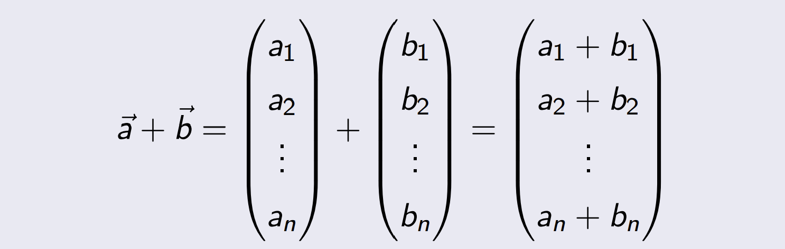

---
title:  'Lineare Algebra'
author:
- Manuel Strenge
keywords: [LA, pain]
...

# Vektoren

## Sinn 

Wenn eine Grösse mit einem wert dargestellt werden kann, wie z.B. Temperator, dann wird es skalar genannt.
$skalare =$ reele zahlen.

Gewisse physische faktoren können nicht nur mit einer nummer dargestellt werden. z.B. Richtung.

**Ein Vektor $R^3$ kann durch 3 reele Zahlen, ein 3-Tupel beschrieben werden.**

> Für 2- oder 3-Tupel lassen sich die Rechenoperationen auch
> geometrisch veranschaulichen. Für allgemeine n-Tupel ist das
> nicht möglich, trotzdem ist die geometrische Anschauung für
> n = 2 oder n = 3 oft der Schlüssel zur Lösung komplizierter
> Probleme.

## Definition

Ein n-Tupel $( a_{1}, a_{2}, . . . , a_{n} ) \in R^{n}$ nennt man auch Vektor.
Die reellen Zahlen $a_{1}, a_{2}, . . ., a_{n}$ heissen die Koordinaten oder Komponenten des Vektors.

Die Komponenten eines Vektors schreiben wir häufig als
Spalten:
$$\underset{a}{\rightarrow} =\begin{pmatrix}a_{1} \\ a_{2} \\ ... \\ a_{n}\\ \end{pmatrix} = R^{n}$$

Zwei Vektoren sind gleich, wenn sie koordinatenweise
übereinstimmen. Die Vektorgleichung $\underset{a}{\rightarrow} = \underset{b}{\rightarrow}$ ist also nichts anderes als eine abkürzende Schreibweise für die $n$ Gleichungen.

$$a_{1} = b_{1} a_{2} = b_{2} ... a_{n} = b_{n} $$

Vektoren in $R^{2}$ bzw. in $R^{3}$ können wir uns als Pfeile vorstellen und der Pfeil darf vom beliebigen Punkt eingezeichnet werden.

Um einen Vektor $\vec{a} = \begin{pmatrix}a_{x} \\ a_{y}\end{pmatrix}$ in $R^{2}$ einzuzeichnen:

1. wählt man einen Anfangspunkt,
2. geht ax Schritte entlang der x-Achse und ay Schritte entlang der y-Achse,
3. erreicht so den Endpunkt des Vektors.

{ width=50% }

Der Vektor $\begin{pmatrix} 1 \\ 2 \\ \end{pmatrix}$ wird auch als Pfeil ausgehend vom Ursprung $O$

Seine Spitze beschreibt den Ort jenes Punktes, dessen Koordinaten
gleich den Komponenten des Vektors sind. Um zu betonen, dass es
der Ortsvektor des Punktes $P$ ist, schreibt man $\vec{OP}$.

[Siehe bild unter definition vektor](#definition)

Zusammenfassend darf der Pfeil in $R^{2}$ bzw. $R^{3}$ beliebig parallel verschoben werden. Es bleibt immer der gleiche Vektor: $\vec{v} = \vec{OP}$

{ width=50% }

**Definition**

> Der Vektor, dessen Anfangspunkt und Endpunkt übereinstimmen, heisst der Nullvektor und wird durch $\vec{0}$ bezeichnet.

## Addition, Subtraktion und Skalarmultiplikation

**Definition**
Die Summe zweier Vektoren der gleichen Dimension $n$ ist
komponentenweise definiert und ergibt wieder einen
$n$-dimensionalen Vektor:

{ width=50% }

**Geometrische betrachtungsweise**

Die geometrische Addition der Vektoren $\vec{a}$ und $\vec{b}$:

1. Der Vektor $\vec{b}$ wird parallel zu sich selbst verschoben, bis sein Anfangspunkt auf den Endpunkt des Vektors $\vec{a}$ trifft
2. Der Anfangspunkt des Vektors $\vec{a}$ wird mit dem Endpunkt des Vektors $\vec{b}$ verbunden. Der resultierende Pfeil repräsentiert den Summenvektor $\vec{c} = \vec{a} + \vec{b}$.

{ width=50% }

$$\vec{a} + \vec{b} = \begin{pmatrix} 7 \\ 5 \\ \end{pmatrix}+ \begin{pmatrix} -2 \\ 4 \\ \end{pmatrix} = \begin{pmatrix} 5 \\ 9 \\ \end{pmatrix}$$ 

**Kommutativgesetz**

$\vec{a} + \vec{b} =   \vec{b} + \vec{a}$.

**Assoziativgesetz**

$(\vec{a} + \vec{b}) + \vec{c} =\vec{a} + (\vec{b} + \vec{c})$.

**Der Nullvektor ist das Neutralelement der Addition**

$\vec{a}+ \vec{0} = \vec{a}$

**Zu jedem Vektor  $\vec{a}$ gibt es genau einen Gegenvektor $-\vec{a} \in R^{n}$ mit**

$\vec{a}+ (- \vec{a}) =  \vec{0}$

Die Subtraktion zweier Vektoren lässt sich wie bei den reellen
Zahlen als Umkehrung der Addition auffassen und damit auf die
Addition zweier Vektoren zurückführen:

**Definition**

Die Subtraktion oder die Differenz von zwei Vektoren $\vec{a}$ und $\vec{b}$ ist
definiert als die Summe von $\vec{a}$ und $-\vec{b}$, dem Gegenvektor zu $\vec{b}$, also:

$\vec{a} - \vec{b} =\vec{a} + (-\vec{b})$

## Multiplikation

Bei der Multiplikation eines Vektors mit einem Skalar $\lambda$ wird jede
Komponente mit $\lambda$ multipliziert:

Das Ergebnis ist wieder ein Vektor im $R^n$.

Die Anschauung der Multiplikation eines Vektors mit einem Skalar im $R^2$:

## Kollineare und windschiefe Vektoren

### Definition

2 Vektoren $\vec{a}$ und $\vec{b}$ heissen kollinear, wenn es eine reelle Zahl $\lambda$
gibt, so dass $\vec{a} = \lambda \vec{b}$. Dies bedeutet, dass $\vec{a}$ ein Vielfaches von $\vec{b}$
ist. Existiert keine solche Zahl, dann sagen wir, dass $\vec{a}$ und $\vec{b}$
windschief oder nichtkollinear sind. 

##  Linearkombination

### Definition

## Weitere Rechengesetze für Vektoren

# Betrag

Der Betrag eines Vektors ist eine reelle Zahl, die >= 0 ist und der
Länge dieses Vektors entspricht.

cc
## Rechenregeln

## Einheitsvektoren

## Skalarprodukte

### Definition

Skalarprodukte treten z.B. im Zusammenhang mit den folgenden
Grössen auf:

- Arbeit einer Kraft beim Verschieben einer Masse,
- Normalform einer Geraden in der Ebene oder einer Ebene.

Das Skalarprodukt zweier Vektoren $\vec{a} \text { und } \vec{b} \text { in } \mathbb{R}^n$ ist ein Skalar
$\vec{a} \cdot \vec{b} \in \mathbb{R}$ (gelesen: a Punkt b), der auf zwei verschiedene Arten
berechnet werden kann:

- aus den Beträgen der beiden Vektoren und dem Kosinus des von den Vektoren eingeschlossenen Winkels $\varphi$:

$$\vec{a} \cdot \vec{b}=|\vec{a}||\vec{b}| \cos (\varphi)$$

- aus den Komponenten der beiden Vektoren:

$$\vec{a} \cdot \vec{b}=a_1 b_1+a_2 b_2+\ldots+a_n b_n=\sum_{i=1}^n a_i b_i$$

- Das Skalarprodukt ist eine skalare Grösse und wird auch als inneres Produkt der Vektoren  $\vec{a}$ und $\vec{b}$ bezeichnet

- Das Skalarprodukt lässt sich auch als: $(\vec{a}, \vec{b}), \quad<\vec{a} \mid \vec{b}>$ oder $\vec{a}^{\top} \vec{b}$ schreiben

- Man beachte, dass der Winkel $\varphi$ stets der kleinere der beiden Winkel ist, den die Vektoren $\vec{a}$ und $\vec{b}$ miteinander bilden.

- $\text { Kommutativgesetz: } \vec{a} \cdot \vec{b}=\vec{b} \cdot \vec{a} \text { für alle Vektoren } \vec{a}, \vec{b} \in \mathbb{R}^n \text {. }$

- Distributivgesetz:
$$
\vec{a} \cdot(\vec{b}+\vec{c})=\vec{a} \cdot \vec{b}+\vec{a} \cdot \vec{c} \quad \text { für alle } \vec{a}, \vec{b}, \vec{c} \in \mathbb{R}^n .
$$

- Gemischtes Assoziativgesetz:
$\lambda(\vec{a} \cdot \vec{b})=(\lambda \vec{a}) \cdot \vec{b}=\vec{a} \cdot(\lambda \vec{b}) \quad$ für alle $\vec{a}, \vec{b} \in \mathbb{R}^n$ und alle $\lambda \in \mathbb{R}$.

Das Skalarprodukt $\vec{a} \cdot \vec{b}$ zweier vom Nullvektor verschiedener
Vektoren kann nur verschwinden, wenn $\cos (\varphi)=0, \text { d.h. } \varphi=90^{\circ}\left(\operatorname{oder} \frac{\pi}{2}\right)$ ist. In diesem Fall stehen die Vektoren senkrecht.
Diese Vektoren heissen orthogonale Vektoren, im Zeichen. $\vec{a} \perp \vec{b}$
Wir haben die Äquivalenz:
$$\vec{a} \cdot \vec{b}=0 \Leftrightarrow \vec{a} \perp \vec{b} .$$

## Berechnung des Winkels 

Mit Hilfe der Gleichung

$$\vec{a} \cdot \vec{b}=|\vec{a}||\vec{b}| \cos (\varphi)=\sum_{i=1}^n a_i b_i$$

kann man den Winkel $\varphi$ zwischen $\vec{a}$ und $\vec{b}$ berechnen:

$$\cos (\varphi)=\frac{\vec{a} \cdot \vec{b}}{|\vec{a}||\vec{b}|}=\frac{\sum_{i=1}^n a_i b_i}{|\vec{a}||\vec{b}|}$$

Wobei $\vec{a} \neq \overrightarrow{0} \text { und } \vec{b} \neq \overrightarrow{0}$ . Durch Umkehrung folgt schliesslich:

$$\varphi=\arccos \left(\frac{\vec{a} \cdot \vec{b}}{|\vec{a}||\vec{b}|}\right) \text {, wobei } \vec{a} \neq \overrightarrow{0} \text { und } \vec{b} \neq \overrightarrow{0}$$

## Projektion eines Vektors auf einen zweiten Vektor

Der durch die Projektion erhaltene Vektor wird mit $\vec{ba}$ bezeichnet.
Es gilt:

$$\cos (\varphi)=\frac{\text { Ankathete }}{\text { Hypotenuse }}=\frac{\left|\vec{b}_a\right|}{|\vec{b}|}$$

wobei $\varphi$ der Winkel zwischen $\vec{a}$ und $\vec{b}$ ist. Sein Betrag lautet somit:

$$
\left|\vec{b}_a\right|=|\vec{b}| \cos (\varphi)
$$

Aus dem Skalarprodukt erhalten wir: $\cos (\varphi)=\frac{\vec{a} \cdot \vec{b}}{|\vec{a}||\vec{b}|}$

Es folgt: $$\left|\vec{b}_a\right|=|\vec{b}| \frac{\vec{a} \cdot \vec{b}}{|\vec{a}||\vec{b}|} \Leftrightarrow\left|\vec{b}_a\right|=\frac{\vec{a} \cdot \vec{b}}{|\vec{a}|}$$

## Berechnung des Winkels $\varphi$

Mit Hilfe der Gleichung

$$\vec{a} \cdot \vec{b}=|\vec{a}||\vec{b}| \cos (\varphi)=\sum_{i=1}^n a_i b_i$$

kann man den Winkel $\varphi$ zwischen $\vec{a}$ und $\vec{b}$ berechnen:

$$\cos (\varphi)=\frac{\vec{a} \cdot \vec{b}}{|\vec{a}||\vec{b}|}=\frac{\sum_{i=1}^n a_i b_i}{|\vec{a}||\vec{b}|}$$

$$\varphi=\arccos \left(\frac{\vec{a} \cdot \vec{b}}{|\vec{a}||\vec{b}|}\right) \text {, wobei } \vec{a} \neq \overrightarrow{0} \text { und } \vec{b} \neq \overrightarrow{0} \text {. }$$

Unter dem Vektorprodukt $\vec{a} \times \vec{b}$ zweier Vektoren $\vec{a} \text { und } \vec{b} \text { in } \mathbb{R}^3$ versteht man den eindeutig bestimmten Vektor, der wie folgt berechnet wird:

$$
\vec{a} \times \vec{b}=\left(\begin{array}{c}
a_x \\
a_y \\
a_z
\end{array}\right) \times\left(\begin{array}{l}
b_x \\
b_y \\
b_z
\end{array}\right)=\left(\begin{array}{c}
a_y b_z-a_z b_y \\
a_z b_x-a_x b_z \\
a_x b_y-a_y b_x
\end{array}\right)
$$

Diese Formel kann man sich anhand des folgenden Schemas merken:

Zwei vom Nullvektor verschiedene Vektoren $\vec{a}$ und $\vec{b}$ sind genau
dann kollinear, wenn ihr Vektorprodukt verschwindet:

$$\vec{a} \times \vec{b}=\overrightarrow{0} \quad \Leftrightarrow \quad \vec{a} \text { und } \vec{b} \text { sind kollinear }$$

Distributivgesetze: $\vec{a} \times(\vec{b}+\vec{c})=\vec{a} \times \vec{b}+\vec{a} \times \vec{c}$ und $(\vec{a}+\vec{b}) \times \vec{c}=\vec{a} \times \vec{c}+\vec{b} \times \vec{c}$

$\text { Anti-Kommutativgesetz: } \vec{a} \times \vec{b}=-(\vec{b} \times \vec{a}) \text {. }$

$\text { Assoziativgesetz: } \lambda(\vec{a} \times \vec{b})=(\lambda \vec{a}) \times \vec{b}=\vec{a} \times(\lambda \vec{b}) \text {. }$

## Spatprodukt

Unter dem Spatprodukt $\left[\begin{array}{lll}\vec{a} & \vec{b} & \vec{c}\end{array}\right]$ dreier Vektoren $\vec{a}, \vec{b}$ und $\vec{c}$ in $\mathbb{R}^3$ versteht man das Skalarprodukt aus dem Vektor $\vec{a}$ und dem aus den Vektoren $\vec{b}$ und $\vec{c}$ gebildeten Vektorprodukt $\vec{b} \times \vec{c}:$

$$\left[\begin{array}{lll}\vec{a} & \vec{b} & \vec{c}\end{array}\right]=\vec{a} \cdot(\vec{b} \times \vec{c})$$

### Spatprodukt und Volumen

Die drei Vektoren
$\vec{a}, \vec{b}$ und $\vec{c}$ spannen
ein sogenanntes
Parallelepiped (auch
Spat, Parallelflach
oder Parallelotop
genannt) auf.

Dem Betrag des Spatproduktes $\left[\begin{array}{lll}\vec{a} & \vec{b} & \vec{c}\end{array}\right]$ kommt dabei die
geometrische Bedeutung des Spatvolumens zu.
Aus der Elementarmathematik haben wir die Formel:

Volumen $=$ Grundfläche mal Höhe $\Leftrightarrow V=\mathcal{A} h$.

# Matrizen 

## Definition

Unter einer $m \times n$ Matrix versteht man ein rechteckiges
Zahlenschema von doppelt indizierten Grössen $a_ij$ mit m waagrecht
angeordneten Zeilen und n senkrecht angeordneten Spalten:

$$
A=\left(\begin{array}{cccccc}a_{11} & a_{12} & \ldots & a_{1 j} & \ldots & a_{1 n} \\ a_{21} & a_{22} & \ldots & a_{2 j} & \ldots & a_{2 n} \\ \vdots & \vdots & \ddots & \vdots & \ddots & \vdots \\ a_{i 1} & a_{i 2} & \ldots & a_{i j} & \ldots & a_{i n} \\ \vdots & \vdots & \ddots & \vdots & \ddots & \vdots \\ a_{m 1} & a_{m 2} & \ldots & a_{m j} & \ldots & a_{m n}\end{array}\right)
$$

**Zuerst Zeile dann spalte**

Die Grössen $a_ij , i = 1, . . . , m, j = 1, . . . , n$ sind reellen Zahlen und
heissen die Elemente der Matrix. m ist die Anzahl der Zeilen und n
die Anzahl der Spalten.

- Matrizen bezeichnen wir gewöhnlich mit grossen lateinischen Buchstaben bsp. A, B, etc.
- Für die $m \times n$ Matrix A schreibt man auch $[a_ij] für i = 1, . . . , m und j = 1, . . . , n$.
- Die Menge aller reellen $m \times n$ Matrizen bezeichnen wir mit $\mathbb{R}^{m \times n}$ 

$$\mathbb{R}^{m \times n}=\left\{A=\left[a_{i j}\right] \mid a_{i j} \in \mathbb{R}, i=1, \ldots, m, j=1, \ldots, n\right\}$$

## Vektoren als Spezialfälle von Matrizen

Eine Matrix, die aus einer einzigen

- Zeile besteht, nennt man Zeilenmatrix oder Zeilenvektor: $A=\left(\begin{array}{llll}a_{11} & a_{12} & \ldots & a_{1 n}\end{array}\right)$
- Spalte besteht, nennt man Spaltenmatrix oder spaltenvektor

$$A=\left(\begin{array}{c}a_{11} \\ a_{21} \\ \vdots \\ a_{m 1}\end{array}\right)$$

- Eine $1 \times 1$-Matrix A ist eine Matrix mit einer einzigen Zeile und einer einzigen Spalte, also ein Skalar $A = (a11).$

## Nullmatrix und quadratische Matrizen

- Eine Matrix, bei der alle Elemente den Wert Null haben, bezeichnet man als Nullmatrix O.
- Eine $n \times n$ Matrix (d.h. m = n) heisst eine quadratische Matrix.

## Anmerkungen

- Die Hauptdiagonale einer quadratischen Matrix verläuft von links oben nach rechts unten. Sie verbindet die Diagonalelemente $a_ii, i = 1, . . . , m$ miteinander.
- Die Diagonalen der Matrix, die parallel zur Hauptdiagonale verlaufen, werden als Nebendiagonalen der Matrix bezeichnet.$
- Die Gegendiagonale verläuft von rechst oben nach links unten.

## Diagonalmatrix

Eine quadratische $n \times n$ Matrix A heisst Diagonalmatrix, falls $a_ij = 0 für alle i 6= j$. Somit

$$A=\left(\begin{array}{ccccc}a_{11} & 0 & 0 & \ldots & 0 \\ 0 & a_{22} & 0 & \ldots & 0 \\ 0 & 0 & a_{33} & \ldots & 0 \\ \vdots & \vdots & \vdots & \ddots & \vdots \\ 0 & 0 & 0 & \ldots & a_{n n}\end{array}\right) \in \mathbb{R}^{n \times n}$$

## Einheitsmatrix

$$I_n=\left(\begin{array}{cccc}1 & 0 & \ldots & 0 \\ 0 & 1 & \ldots & 0 \\ \vdots & \vdots & \ddots & \vdots \\ 0 & 0 & \ldots & 1\end{array}\right) \in \mathbb{R}^{n \times n}$$

nennen wir die Einheitsmatrix oder die Identität.

## Dreiecksmatrizen

Eine quadratische $n \times n$ Matrix, die oberhalb der Hauptdiagonalen nur Nullen enthält, heisst untere Dreiecksmatrix. Sind alle Elemente unter der Haupdiagonalen null, so heisst sie obere Dreiecksmatrix:

Untere Dreiecksmatrix: A =

$$\left(\begin{array}{ccccc}a_{11} & 0 & 0 & \ldots & 0 \\ a_{21} & a_{22} & 0 & \ldots & 0 \\ \vdots & \vdots & \vdots & \ddots & \vdots \\ a_{n 1} & a_{n 2} & a_{n 3} & \ldots & a_{n n}\end{array}\right)$$

Obere Dreiecksmatrix: A =

$$\left(\begin{array}{cccc}a_{11} & a_{12} & \ldots & a_{1 n} \\ 0 & a_{22} & \ldots & a_{2 n} \\ \vdots & \vdots & \ddots & \vdots \\ 0 & 0 & \ldots & a_{n n}\end{array}\right)$$

## Symmetrische Matrizen

Eine quadratische $n \times n$ Matrix A heisst symmetrisch, wenn

$a_{i j}=a_{j i}$, für alle $i, j=1, \ldots, n$.

Die Matrix A =

$$\left(\begin{array}{cccc}1 & 4 & -2 & -10 \\ 4 & 5 & 0 & -1 \\ -2 & 0 & 8 & 5 \\ -10 & -1 & 5 & 15\end{array}\right)$$

ist symmetrisch.

## Rechnen mit Matrizen

## Gleichheit von Matrizen

Matrizen sind nicht nur praktisch in der Lagerung von Information sondern auch in deren Verarbeitung. Man kann mit ihnen ähnlich wie mit den reellen Zahlen rechnen.

Zunächst müssen wir klären, wann zwei Matrizen A und B gleich sind. Um zwei Matrizen vergleichen zu können, müssen sie dieselbe Dimension haben.

Zwei $m \times n$ Matrizen $A=\left[a_{i j}\right]$ und $B=\left[b_{i j}\right]$ heissen gleich, $A=B$, wenn gilt: $a_{i j}=b_{i j}$, für alle $i=1, \ldots, m$ und $j=1, \ldots, n$.

## Addition und Subtraktion

Seien A und B zwei $m \times n$ Matrizen. Dann:

Gegeben sind 

$$A=\left(\begin{array}{lll}
1 & 2 & 3 \\
3 & 3 & 5
\end{array}\right)$$

$$B=\left(\begin{array}{ccc}
0 & -1 & 3 \\
-3 & -5 & 0
\end{array}\right)$$

dann:

$$\begin{aligned}
A+B & =\left(\begin{array}{lll}
1 & 2 & 3 \\
3 & 3 & 5
\end{array}\right)+\left(\begin{array}{ccc}
0 & -1 & 3 \\
-3 & -5 & 0
\end{array}\right) \\
& =\left(\begin{array}{lll}
1+0 & 2-1 & 3+3 \\
3-3 & 3-5 & 5+0
\end{array}\right)=\left(\begin{array}{ccc}
1 & 1 & 6 \\
0 & -2 & 5
\end{array}\right)
\end{aligned}$$

## Rechenregeln der Addition

Gegeben sind die $m \times n$ Matrizen A, B und C. Dann gilt:

- Kommutativgesetz: $A + B = B + A$
- Assoziativgesetz: $(A + B) + C = A + (B + C)$

## Skalare Multiplikation

Die skalare Multiplikation der $m \times n$ Matrix A mit dem reellen
Skalar $\lambda$ ist definiert durch die elementweise Multiplikation mit $\lambda$:

$$\lambda A=\lambda\left(\begin{array}{cccc}
a_{11} & a_{12} & \ldots & a_{1 n} \\
a_{21} & a_{22} & \ldots & a_{2 n} \\
\vdots & \vdots & \ddots & \vdots \\
a_{m 1} & a_{m 2} & \ldots & a_{m n}
\end{array}\right)=\left(\begin{array}{cccc}
\lambda a_{11} & \lambda a_{12} & \ldots & \lambda a_{1 n} \\
\lambda a_{21} & \lambda a_{22} & \ldots & \lambda a_{2 n} \\
\vdots & \vdots & \ddots & \vdots \\
\lambda a_{m 1} & \lambda a_{m 2} & \ldots & \lambda a_{m n}
\end{array}\right)$$

## Gemeinsamer Faktor

Besitzen alle Elemente einer Matrix einen gemeinsamen Faktor,
so kann dieser vor die Matrix gezogen werden.

$$A=\left(\begin{array}{ccc}
5 & 10 & -20 \\
0 & -5 & 30
\end{array}\right)
=
5\left(\begin{array}{ccc}
1 & 2 & -4 \\
0 & -1 & 6
\end{array}\right)$$

## Rechenregeln der skalaren Multiplikation

- Assoziativgesetz: $\lambda(\mu A)=\mu(\lambda A)=(\lambda \mu) A$
- Distributivgesetze: $(\lambda+\mu) A=\lambda A+\mu A \quad \text { und } \quad \lambda(A+B)=\lambda A+\lambda B$

## Linearkombination von Matrizen

Für Matrizen $A_1, A_2, \ldots, A_p$ derselben Grösse und Skalare $\lambda_1, \lambda_2$, $\ldots, \lambda_p$ heisst der Ausdruck

$$\lambda_1 A_1+\lambda_2 A_2+\ldots+\lambda_p A_p$$

Linearkombination von $A_1, A_2, \ldots, A_p$ mit den Koeffizienten $\lambda_1$ $\lambda_2, \ldots, \lambda_p$

## Multiplikation von Matrizen

Im Gegensatz zur Addition von Matrizen erfolgt die Multiplikation
von Matrizen **NICHT ELEMENTWEISE**.

$\text { Gegeben sei die } m \times n \text { Matrix } A \text { und die } n \times p \text { Matrix } B \text {. }$

Die Produktmatrix $C=A B$ ist eine $m \times p$ Matrix, und berechnet sich wie folgt:

$$\begin{aligned}
c_{i j} & =[A B]_{i j}=a_{i 1} b_{1 j}+a_{i 2} b_{2 j}+\ldots+a_{i n} b_{n j} \\
& =\sum_{k=1}^n a_{i k} b_{k j}, \quad \text { für } i=1, \ldots, m \text { und } j=1, \ldots, p .
\end{aligned}$$

### Merkregel

Das Matrixelement $c_{i j}$ bekommt man wie folgt:
$c_{i j}=i$-te Zeile der Matrix $A$ mal $j$-te Spalte der MatrixB.
Die untenstehende Skizze veranschaulicht diese Merkregel:

$$\left(\begin{array}{cccccc}
a_{11} & a_{12} & . . & a_{1 k} & . . & a_{1 n} \\
\vdots & \vdots & & \vdots & & \vdots \\
a_{i 1} & a_{i 2} & . . & a_{i k} & . . & a_{i n} \\
\vdots & \vdots & & \vdots & & \vdots \\
a_{m \mathbf{1}} & a_{m \mathbf{2}} & . . & a_{m k} & . . & a_{m n}
\end{array}\right)\left(\begin{array}{ccccc}
b_{11} & . . & b_{1 j} & . . & b_{1 p} \\
b_{21} & . . & b_{2 j} & . . & b_{\mathbf{2 p}} \\
\vdots & & \vdots & & \vdots \\
b_{k 1} & . . & b_{k j} & . . & b_{k p} \\
\vdots & & \vdots & & \vdots \\
b_{n \mathbf{1}} & . . & b_{n j} & . . & b_{n p}
\end{array}\right)=\left(\begin{array}{ccccc}
c_{11} & . . & c_{1 j} & . . & c_{1 p} \\
\vdots & & \vdots & & \vdots \\
c_{i 1} & . . & c_{i j} & . & c_{i p} \\
\vdots & & \vdots & & \vdots \\
c_{m \mathbf{1}} & . . & c_{m j} & . . & c_{m p}
\end{array}\right)$$

> **Die Anzahl von Spalten in A muss gleich der Anzahl von Zeilen in B sein.**

### Falk Schema

Das Matrizenprodukt ist i. Allg. nicht kommutativ: $A B \neq B A$.

### Das Produkt zweier $n \times n$ Diagonalmatrizen ist kommutativ:

$$
\begin{aligned}
& \left(\begin{array}{ccc}
a_{11} & 0 & 0 \\
0 & a_{22} & 0 \\
0 & 0 & a_{33}
\end{array}\right)\left(\begin{array}{ccc}
b_{11} & 0 & 0 \\
0 & b_{22} & 0 \\
0 & 0 & b_{33}
\end{array}\right)=\left(\begin{array}{ccc}
a_{11} b_{11} & 0 & 0 \\
0 & a_{22} b_{22} & 0 \\
0 & 0 & a_{33} b_{33}
\end{array}\right) \\
= & \left(\begin{array}{ccc}
b_{11} a_{11} & 0 & 0 \\
0 & b_{22} a_{22} & 0 \\
0 & 0 & b_{33} a_{33}
\end{array}\right)=\left(\begin{array}{ccc}
b_{11} & 0 & 0 \\
0 & b_{22} & 0 \\
0 & 0 & b_{33}
\end{array}\right)\left(\begin{array}{ccc}
a_{11} & 0 & 0 \\
0 & a_{22} & 0 \\
0 & 0 & a_{33}
\end{array}\right)
\end{aligned}
$$

### Rechenregeln der Matrizenmultiplikation

Distributivgesetze:

$$\left(A_1+A_2\right) B=A_1 B+A_2 B \text { und } A\left(B_1+B_2\right)=A B_1+A B_2 \text {. }$$

Assoziativgesetze:

$$(A B) C=A(B C) \text { und } \lambda(A B)=(\lambda A) B=A(\lambda B) \text { für alle } \lambda \in \mathbb{R} \text {. }$$

Weiteres Gesetz:

$$A I_n=A \text { und } I_m A=A \text {. }$$

### Inverse Matrix

Gibt es zu einer $n \times n$ Matrix $A$ eine Matrix $X$ mit $A X=X A=I_n$, so heisst $X$ die zu $A$ inverse Matrix. Sie wird durch das Symbol $A^{-1}$ gekennzeichnet.

Die Matrizen $A=\left(\begin{array}{cc}1 & -2 \\ -1 & 3\end{array}\right)$ und $B=\left(\begin{array}{ll}3 & 2 \\ 1 & 1\end{array}\right)$ sind zueinander invers:
$$
\begin{aligned}
& \qquad A B=\left(\begin{array}{cc}
1 & -2 \\
-1 & 3
\end{array}\right)\left(\begin{array}{cc}
3 & 2 \\
1 & 1
\end{array}\right)=\left(\begin{array}{cc}
3-2 & 2-2 \\
-3+3 & -2+3
\end{array}\right)=\left(\begin{array}{ll}
1 & 0 \\
0 & 1
\end{array}\right) \\
& \text { und } B A=\left(\begin{array}{ll}
3 & 2 \\
1 & 1
\end{array}\right)\left(\begin{array}{cc}
1 & -2 \\
-1 & 3
\end{array}\right)=\left(\begin{array}{cc}
3-2 & -6+6 \\
1-1 & -2+3
\end{array}\right)=\left(\begin{array}{ll}
1 & 0 \\
0 & 1
\end{array}\right) \text {. }
\end{aligned}
$$
Somit gilt: $A B=B A=I_2$.

- Falls eine quadratische Matrix $A$ eine Inverse $A^{-1}$ besitzt, so ist $A^{-1}$ eindeutig bestimmt. Die Matrix $A$ heisst in diesem Fall invertierbar (oder umkehrbar). Andernfalls heisst sie singulär.
- Es gilt: $A A^{-1}=A^{-1} A=I_n$. Das heisst, dass $A$ und $A^{-1}$ kommutativ sind.

$$\left(A_1 A_2 \cdots A_k\right)^{-1}=A_k^{-1} \cdots A_2^{-1} A_1^{-1}$$

Sei $A$ eine $m \times n$ Matrix. Die transponierte Matrix $A^T$ erhält man aus $A$, indem man die $i$-te Spalte von $A$ zur $i$-ten Zeile von $A^T$ macht. Kurz: $\left[A^T\right]_{i j}=a_{j i}$.
Skizze:
$$
A=\left(\begin{array}{ccccc}
a_{11} & \ldots & a_{1 i} & \ldots & a_{1 n} \\
a_{21} & \ldots & a_{2 i} & \ldots & a_{2 n} \\
\vdots & & \vdots & & \vdots \\
a_{m 1} & \ldots & a_{m i} & \ldots & a_{m n}
\end{array}\right) \longrightarrow A^T=\left(\begin{array}{cccc}
a_{11} & a_{21} & \cdots & a_{m 1} \\
\vdots & \vdots & & \vdots \\
a_{1 i} & a_{2 i} & \cdots & a_{m i} \\
\vdots & \vdots & & \vdots \\
a_{1 n} & a_{2 n} & \cdots & a_{m n}
\end{array}\right)
$$

Wir transponieren die folgenden Matrizen:
$$
A=\left(\begin{array}{cc}
1 & 3 \\
4 & 2 \\
0 & -8
\end{array}\right), \quad B=\left(\begin{array}{ccc}
1 & 1 & 1 \\
0 & -2 & 5 \\
7 & 6 & 0
\end{array}\right) \quad \text { und } \quad C=\left(\begin{array}{l}
1 \\
2 \\
9
\end{array}\right)
$$
Es gilt:
$$
A^T=\left(\begin{array}{ccc}
1 & 4 & 0 \\
3 & 2 & -8
\end{array}\right), \quad B^T=\left(\begin{array}{ccc}
1 & 0 & 7 \\
1 & -2 & 6 \\
1 & 5 & 0
\end{array}\right) \quad \text { und } \quad C^T=\left(\begin{array}{lll}
1 & 2 & 9
\end{array}\right)
$$

Mit dieser neuen Operation gewinnen wir die Notation $\vec{a}^T \vec{b}$ für das Skalarprodukt $\vec{a} \cdot \vec{b}$.

$$\begin{aligned}
\vec{a}^T \vec{b} & =\left(\begin{array}{llll}
a_1 & a_2 & \cdots & a_n
\end{array}\right)\left(\begin{array}{c}
b_1 \\
b_2 \\
\vdots \\
b_n
\end{array}\right) \\
& =a_1 b_1+a_2 b_2+\ldots+a_n b_n=\vec{a} \cdot \vec{b}, \quad \text { für alle } \vec{a}, \vec{b} \in \mathbb{R}^n .
\end{aligned}$$

Rechenregeln mit Transponierten
1. $(A+B)^T=A^T+B^T$ für alle $m \times n$ Matrizen $A$ und $B$.
2. $(\lambda A)^T=\lambda A^T$ für alle $m \times n$ Matrizen $A$ und alle $\lambda \in \mathbb{R}$.
3. $(A B)^T=B^T A^T$ für alle $m \times n$ Matrizen $A$ und alle $n \times p$ Matrizen $B$.
4. $\left(A^T\right)^{-1}=\left(A^{-1}\right)^T$ für alle invertierbare $n \times n$ Matrizen $A$.

# Lineare Gleichungssysteme

Eine lineare Gleichung in einer Variable $x$ ist von der Form
$$
a x=b,
$$
wobei $a, b$ reelle Konstanten sind. Für $a \neq 0$ ist $x=\frac{b}{a}$ die 
Lösung.

## Lineare Gleichung in n Variablen und Lösungsmenge

Ein lineares Gleichungssystem (LGS) besteht aus m linearen
Gleichungen mit n Unbekannten x1, x2, . . . , xn. Ein solches System
hat die folgende Gestalt:

$$\left\{\begin{array}{cccc}
a_{11} x_1+a_{12} x_2+\ldots+a_{1 n} x_n & = & b_1 \\
a_{21} x_1+a_{22} x_2+\ldots+a_{2 n} x_n & = & b_2 \\
\vdots & \vdots & \vdots & \vdots \\
a_{m 1} x_1+a_{m 2} x_2+\ldots+a_{m n} x_n & = & b_m
\end{array}\right.$$

Besitzt ein lineares Gleichungssystem keine Lösung, so sagt man, es
ist unlösbar (oder inkonsistent). Hat das System mindestens eine
Lösung, so ist es lösbar (oder konsistent).

Sind die rechten Seiten des Gleichungssystems Null, das heisst $b_1=b_2=\ldots=b_m=0$, so heisst das System homogen, andernfalls inhomogen $\left(b_i, i=1, \ldots, m\right.$ sind nicht alle gleich

Zwei Gleichungssysteme sind äquivalent, wenn sie dieselbe
Lösungsmenge haben.

### Matrizen und LGS

Mit den Bezeichnungen

$$A=\left(\begin{array}{cccc}
a_{11} & a_{12} & \ldots & a_{1 n} \\
a_{21} & a_{22} & \ldots & a_{2 n} \\
\vdots & \vdots & \ddots & \vdots \\
a_{m 1} & a_{m 2} & \ldots & a_{m n}
\end{array}\right) \in \mathbb{R}^{m \times n}, \vec{x}=\left(\begin{array}{c}
x_1 \\
x_2 \\
\vdots \\
x_n
\end{array}\right), \vec{b}=\left(\begin{array}{c}
b_1 \\
b_2 \\
\vdots \\
b_m
\end{array}\right)$$

lässt sich

$$\left\{\begin{array}{cccc}
a_{11} x_1+a_{12} x_2+\ldots+a_{1 n} x_n & = & b_1 \\
a_{21} x_1+a_{22} x_2+\ldots+a_{2 n} x_n & = & b_2 \\
\vdots & \vdots & \vdots & \vdots \\
a_{m 1} x_1+a_{m 2} x_2+\ldots+a_{m n} x_n & = & b_m
\end{array}\right.$$

als $A \vec{x}=\vec{b}$ schreiben. $A \in \math bb{R}^{m \times n}$ ist die Koeffizientenmatrix, $\vec{b} \in \mathbb{R}^m$ ist die rechte Seite des LGS und $\vec{x} \in \mathbb{R}^n$ ist der gesuchte Vektor der Unbekannten.

## Elementare Umformungen und Zeilenstufenformen

Das folgende lineare Gleichungssystem ist in Zeilenstufenform
$$
\left\{\begin{aligned}
2 x+6 y+2 z & =8 \\
y+z & =-4 \\
-2 z & =10
\end{aligned}\right.
$$

Durch Rückwärtseinsetzen kann dieses System direkt gelöst werden.

Elementare Gleichungsumformungen:

- Vertauschen von den i-ten und j-ten Gleichungen,
- Multiplikation der $i$-ten Gleichung mit einem von Null verschiedenen Skalar $\lambda$,
- Addition eines $\lambda$-fachen der $j$-ten Gleichung zu der $i$-ten Gleichung.

Eine Matrix hat Zeilenstufenform (ZSF), wenn folgende
Eigenschaften erfüllt sind:

- Alle Zeilen, die nur Nullen enthalten, stehen in den untersten Zeilen der Matrix.
- Wenn eine Zeile nicht nur aus Nullen besteht, so ist die erste von Null verschiedene Zahl eine Eins. Sie wird als führende Eins der Zeile bezeichnet.
- In zwei aufeinanderfolgenden Zeilen, die nicht verschwindende Elemente besitzen, steht die führende Eins der unteren Zeile rechts von der führenden Eins der oberen Zeile.

Besitzt eine Matrix Zeilenstufenform und gilt noch zusätzlich:
- eine Spalte, die eine führende Eins enthält, hat keine weiteren von Null verschiedenen Einträge,

dann hat die Matrix reduzierte Zeilenstufenform.

Liegt eine Matrix in Zeilenstufenform vor, so stehen unter einer
führenden Eins nur Nullen.
Hat die Matrix sogar reduzierte Zeilenstufenform, so stehen auch
über einer führenden Eins nur Nullen.

Durch elementare Zeilenumformungen kann man stets die
erweiterte Koeffizientenmatrix eines linearen Gleichungssystems auf
Zeilenstufenform oder reduzierte Zeilenstufenform bringen.

### Reduzierte Zeilenstufenform

Besitzt eine Matrix Zeilenstufenform und gilt noch zusätzlich:
eine Spalte, die eine führende Eins enthält, hat keine weiteren
von Null verschiedenen Einträge,
dann hat die Matrix reduzierte Zeilenstufenform.

## Das Gauss- und Gauss-Jordan-Verfahren

