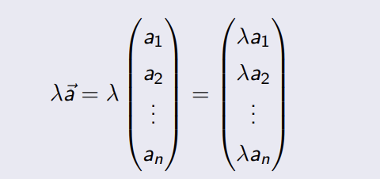

---
title:  'Lineare Algebra'
author:
- Manuel Strenge
keywords: [LA, pain]
...

# Vektoren

## Sinn 

Wenn eine Grösse mit einem wert dargestellt werden kann, wie z.B. Temperator, dann wird es skalar genannt.
$skalare =$ reele zahlen.

Gewisse physische faktoren können nicht nur mit einer nummer dargestellt werden. z.B. Richtung.

**Ein Vektor $R^3$ kann durch 3 reele Zahlen, ein 3-Tupel beschrieben werden.**

> Für 2- oder 3-Tupel lassen sich die Rechenoperationen auch
> geometrisch veranschaulichen. Für allgemeine n-Tupel ist das
> nicht möglich, trotzdem ist die geometrische Anschauung für
> n = 2 oder n = 3 oft der Schlüssel zur Lösung komplizierter
> Probleme.

## Definition

Ein n-Tupel $( a_{1}, a_{2}, . . . , a_{n} ) \in R^{n}$ nennt man auch Vektor.
Die reellen Zahlen $a_{1}, a_{2}, . . ., a_{n}$ heissen die Koordinaten oder Komponenten des Vektors.

Die Komponenten eines Vektors schreiben wir häufig als
Spalten:
$$\underset{a}{\rightarrow} =\begin{pmatrix}a_{1} \\ a_{2} \\ ... \\ a_{n}\\ \end{pmatrix} = R^{n}$$

Zwei Vektoren sind gleich, wenn sie koordinatenweise
übereinstimmen. Die Vektorgleichung $\underset{a}{\rightarrow} = \underset{b}{\rightarrow}$ ist also nichts anderes als eine abkürzende Schreibweise für die $n$ Gleichungen.

$$a_{1} = b_{1} a_{2} = b_{2} ... a_{n} = b_{n} $$

Vektoren in $R^{2}$ bzw. in $R^{3}$ können wir uns als Pfeile vorstellen und der Pfeil darf vom beliebigen Punkt eingezeichnet werden.

Um einen Vektor $\vec{a} = \begin{pmatrix}a_{x} \\ a_{y}\end{pmatrix}$ in $R^{2}$ einzuzeichnen:

1. wählt man einen Anfangspunkt,
2. geht ax Schritte entlang der x-Achse und ay Schritte entlang der y-Achse,
3. erreicht so den Endpunkt des Vektors.

{ width=50% }

Der Vektor $\begin{pmatrix} 1 \\ 2 \\ \end{pmatrix}$ wird auch als Pfeil ausgehend vom Ursprung $O$

Seine Spitze beschreibt den Ort jenes Punktes, dessen Koordinaten
gleich den Komponenten des Vektors sind. Um zu betonen, dass es
der Ortsvektor des Punktes $P$ ist, schreibt man $\vec{OP}$.

[Siehe bild unter definition vektor](#definition)

Zusammenfassend darf der Pfeil in $R^{2}$ bzw. $R^{3}$ beliebig parallel verschoben werden. Es bleibt immer der gleiche Vektor: $\vec{v} = \vec{OP}$

{ width=50% }

**Definition**

> Der Vektor, dessen Anfangspunkt und Endpunkt übereinstimmen, heisst der Nullvektor und wird durch $\vec{0}$ bezeichnet.

## Addition, Subtraktion und Skalarmultiplikation

**Definition**
Die Summe zweier Vektoren der gleichen Dimension $n$ ist
komponentenweise definiert und ergibt wieder einen
$n$-dimensionalen Vektor:

{ width=50% }

**Geometrische betrachtungsweise**

Die geometrische Addition der Vektoren $\vec{a}$ und $\vec{b}$:

1. Der Vektor $\vec{b}$ wird parallel zu sich selbst verschoben, bis sein Anfangspunkt auf den Endpunkt des Vektors $\vec{a}$ trifft
2. Der Anfangspunkt des Vektors $\vec{a}$ wird mit dem Endpunkt des Vektors $\vec{b}$ verbunden. Der resultierende Pfeil repräsentiert den Summenvektor $\vec{c} = \vec{a} + \vec{b}$.

{ width=50% }

$$\vec{a} + \vec{b} = \begin{pmatrix} 7 \\ 5 \\ \end{pmatrix}+ \begin{pmatrix} -2 \\ 4 \\ \end{pmatrix} = \begin{pmatrix} 5 \\ 9 \\ \end{pmatrix}$$ 

**Kommutativgesetz**

$\vec{a} + \vec{b} =   \vec{b} + \vec{a}$.

**Assoziativgesetz**

$(\vec{a} + \vec{b}) + \vec{c} =\vec{a} + (\vec{b} + \vec{c})$.

**Der Nullvektor ist das Neutralelement der Addition**

$\vec{a}+ \vec{0} = \vec{a}$

**Zu jedem Vektor  $\vec{a}$ gibt es genau einen Gegenvektor $-\vec{a} \in R^{n}$ mit**

$\vec{a}+ (- \vec{a}) =  \vec{0}$

Die Subtraktion zweier Vektoren lässt sich wie bei den reellen
Zahlen als Umkehrung der Addition auffassen und damit auf die
Addition zweier Vektoren zurückführen:

**Definition**

Die Subtraktion oder die Differenz von zwei Vektoren $\vec{a}$ und $\vec{b}$ ist
definiert als die Summe von $\vec{a}$ und $-\vec{b}$, dem Gegenvektor zu $\vec{b}$, also:

$\vec{a} - \vec{b} =\vec{a} + (-\vec{b})$

## Multiplikation

Bei der Multiplikation eines Vektors mit einem Skalar $\lambda$ wird jede
Komponente mit $\lambda$ multipliziert:

Das Ergebnis ist wieder ein Vektor im $R^n$.

Die Anschauung der Multiplikation eines Vektors mit einem Skalar im $R^2$:

## Kollineare und windschiefe Vektoren

### Definition

2 Vektoren $\vec{a}$ und $\vec{b}$ heissen kollinear, wenn es eine reelle Zahl $\lambda$
gibt, so dass $\vec{a} = \lambda \vec{b}$. Dies bedeutet, dass $\vec{a}$ ein Vielfaches von $\vec{b}$
ist. Existiert keine solche Zahl, dann sagen wir, dass $\vec{a}$ und $\vec{b}$
windschief oder nichtkollinear sind. 

##  Linearkombination

### Definition

## Weitere Rechengesetze für Vektoren

# Betrag

Der Betrag eines Vektors ist eine reelle Zahl, die >= 0 ist und der
Länge dieses Vektors entspricht.

cc
## Rechenregeln

## Einheitsvektoren

