---
title:  'Theoretische Informatik'
author:
- Manuel Strenge
keywords: [TH, pain]
...

# Aplhabete

> **Mächtig was ist die Decke der Menge: Unendlich=sehr mächtig**

Ein Alphabet ist eine endliche, nichtleere Menge von Symbolen

{:),2} -> alphabet

{1,2,3} -> alphabet

{1,2,3,...} -> kein da nicht endlich

{a,...,b}  -> alphabet

{a,a,a}-> ja

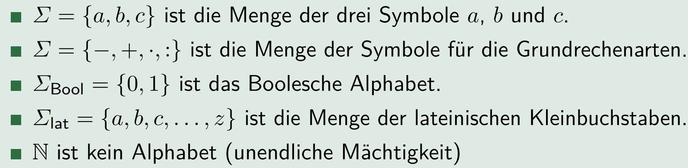

# Wort

Ein Wort (Zeichenreihe, String) ist eine endliche Folge von Symbolen
eines bestimmten Alphabets

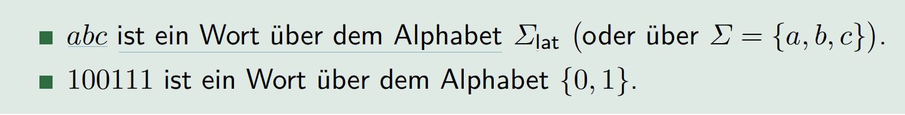

## Leeres Wort

Das **leere** Wort ist ein Wort, das keine Symbole enthält. Es wird durch
das Symbol $\varepsilon$ dargestellt und ist ein Wort über jedem Alphabet.

# Wörter

Die Länge eines Wortes $w$ ist die Länge des Wortes als Folge, also die
Anzahl der Symbole der Folge. Wir bezeichnen diese Länge mit $|w|$.

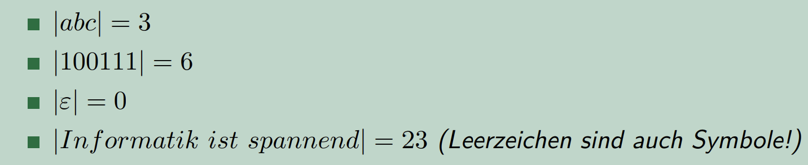

## Definition (Häufigkeit eines Symbols in einem Wort)

$|w|_{x}$ bezeichnet die absolute Häufigkeit eines Symbols $x$ in einem
Wortes $w$.

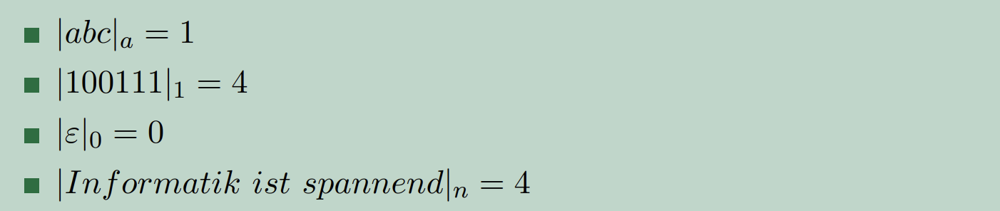

## Definition (Spiegelung eines Wort)

Mit $w^R$ wird das Spiegelwort zu $w$ bezeichnet.

$$w^{R} = (x_{1}, x_{2} . . . x_{n})^R = x_{n} . . . x_{2}, x_{1}$$

Es gilt $|w| = |w^{R}| und |w|_{x} = |w^{R}|_{x} für alle x \in \sum$. Wenn $w = w R$ gilt, dann bezeichnet man w als Palindrom.

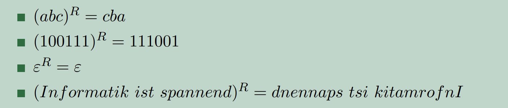

## Definition (Teilwort)

Wir sagen, dass $v$ ein Teilwort (Infix) von $w$ ist, wenn man $w$ als

$$w=xvy$$

für beliebige Wörter $x$ und $y$ über $\sum$ schreiben kann

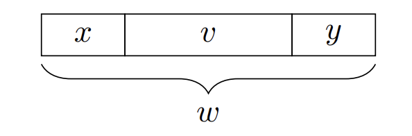

## Definition (echtes Teilwort)

Ein echtes Teilwort von $w$ ist jedes Teilwort von $w$, das nicht identisch
mit $w$ ist (in diesem Falle ist $x$ oder $y$ nicht leer).

In Programmiersprachen ist der Begriff substring gebräuchlich.

## Präfix

Ein Wort $v$ ist ein Präfix von $w$, wenn

$$w=xy$$

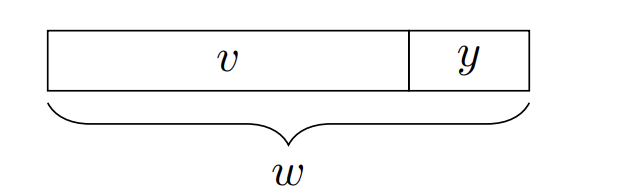

Ein echtes Präfix von w ist jedes Präfix von w, das nicht identisch mit w
ist (in diesem Fall ist y leer).

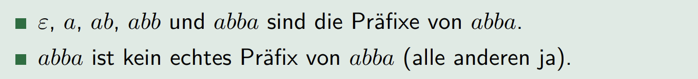

## Definition (Suffix)

Ein Wort v ist ein Suffix von w, wenn

$$w=xv$$

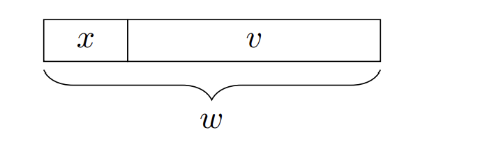

Ein echtes Suffix von w ist jedes Suffix von w, das nicht identisch mit w
ist (in diesem Fall ist x leer).

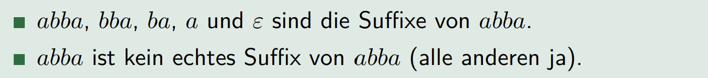

## Definition (Menge aller Wörter der Länge k)

Die Menge aller Wörter der Länge k über einem Alphabet $\sum$ wird mit
$\sum^{k}$ bezeichnet.

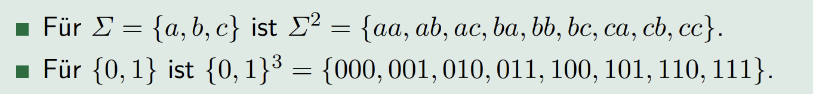

## Definition (Menge aller Wörter (Zeichenreihen))

Die Menge aller Wörter (Kleenesche Hülle) über einem Alphabet $\sum$
wird mit $\sum^{*}$ bezeichnet.
$\sum+ = \sum* \ {\varepsilon}$ ist die Menge aller nichtleeren Wörter (positive
Hülle) über einem Alphabet $\sum$.

> Regex definitionen ursprung von hier. 

### Eigenschaften

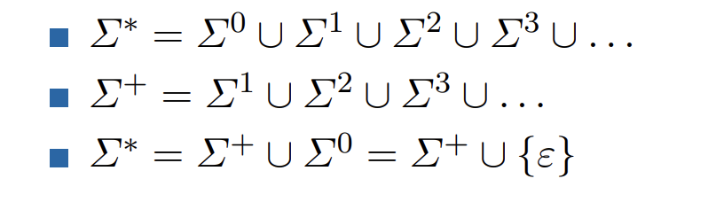

## Definition (Konkatenation)

Definition (Konkatenation) Seien $x$ und $y$ zwei beliebige Wörter. Dann steht

$x \circ y = xy := (x_{1}, x_{2} . . . x_{n}, y_{1}, y_{2} . . . y_{m})$

für die Konkatenation (Verkettung) von $x$ und $y$.

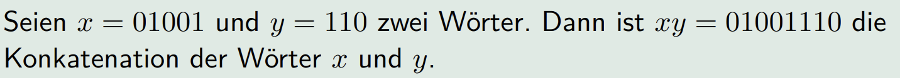

## Definition (Wortpotenzen)

Sei $x$ ein Wort über einem Alphabet $\sum$. Für alle $n \in N$ sind
Wortpotenzen wie folgt definiert:

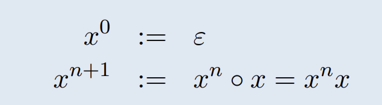

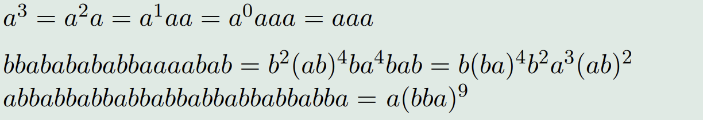

## Definition (Sprache)

Eine Teilmenge $L \subseteq  \sum^{*}$ von Wörtern über einem Alphabet $\sum$ wird als Sprache über $\sum$ bezeichnet.

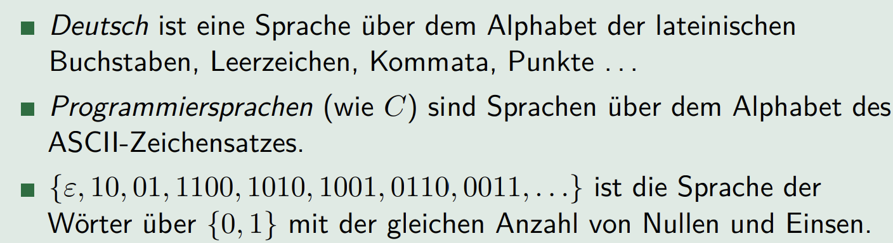

### Anmerkungen:
- Sprachen können aus unendlich vielen Wörtern bestehen.
- Wörter müssen aus einem festen, endlichen Alphabet gebildet werden.
- Wörter selber haben eine endliche Länge.

## Definition (Konkatenation von Sprachen)

Sind $A \subset \sum^{*}$ und $B \subset \tau^{*}$ beliebige Sprachen, dann wird die Menge

$$AB = {uv | u \in A und v \in B}$$

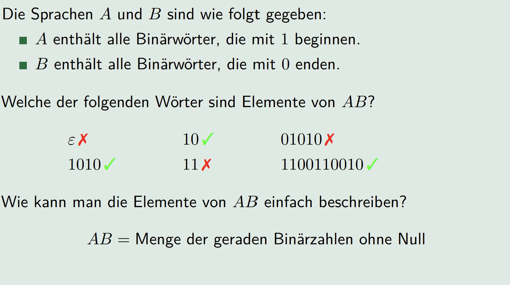

# Reguläre Ausdrücke

Reguläre Ausdrücke sind Wörter, die Sprachen beschreiben, also eine
Möglichkeit (gewisse) Sprachen endlich zu repräsentieren.

- Die Syntax der regulären Ausdrücke befasst sich mit der Frage, welche Form diese Wörter haben.
- In der Semantik der regulären Ausdrücke wird erklärt, wie man reguläre Ausdrücke als Sprachen interpretiert.

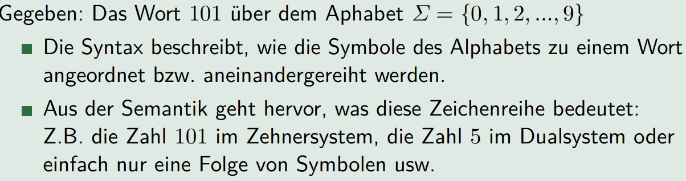
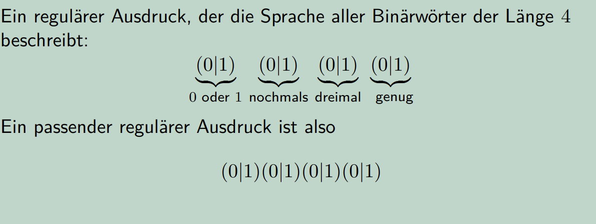
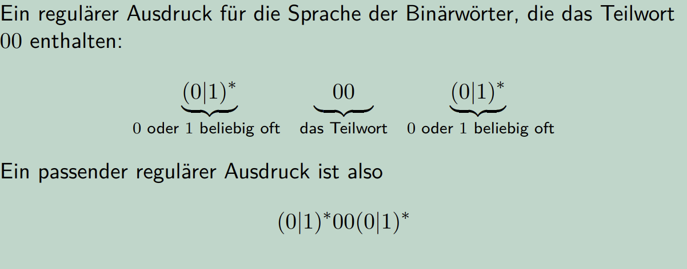

## Definition (Reguläre Ausdrücke)

Es sei $\sum$ ein beliebiges Alphabet. Die Sprache $RA \sum$ der regulären
Ausdrücke über $\sum$ ist wie folgt definiert:

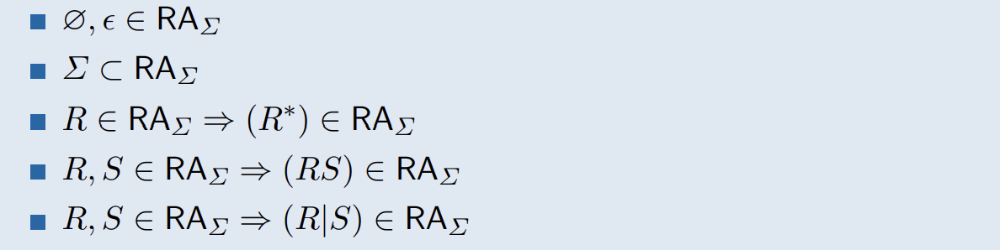

## Erläuterungen zur Definition

- Die Sonderzeichen $\varepsilon$ und $\varnothing$ sind reguläre Ausdrücke.
- Jedes Symbol aus dem Alphabet $\sum$ ist auch ein regulärer Ausdruck über $\sum$.
- Ist $R$ ein regulärer Ausdruck über $\sum$, dann ist auch $(R^{*})$ ein regulärer Ausdruck über $\sum$.
- Sind $R$ und $S$ reguläre Ausdrücke über $\sum$, dann sind auch $(RS)$ und $(R|S)$ Ausdrücke über $\sum$.

# Eigenschaften und Konventionen:

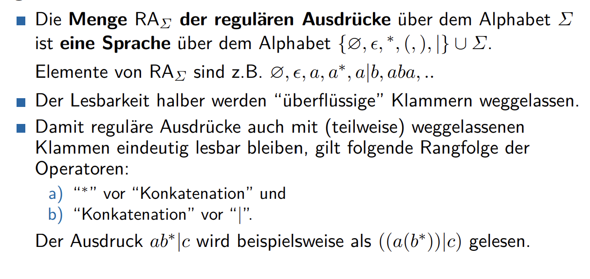

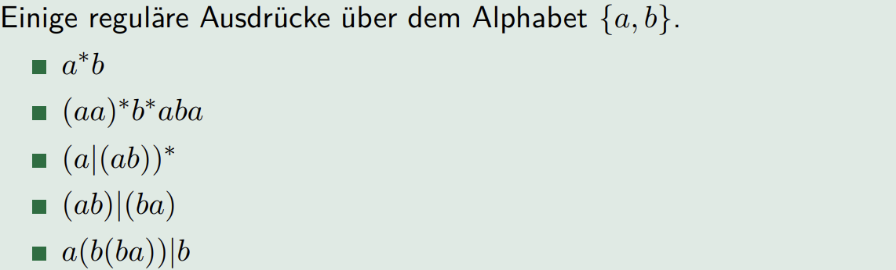

# Reguläre Sprachen

## Satz (Rechenregeln für reguläre Ausdrücke)

- L(R|S) = L(S|R)
- L(R(ST)) = L((RS)T)
- L(R|(S|T)) = L((R|S)|T)
- L(R(S|T)) = L(RS|RT)
- L((R\*)\*) = L(R\*)
- L(R|R) = L(R)

## Anwendungen von regulären Ausdrücken:

- Mustersuche in Texten
- Lexikalische Analyse (in Compilern); Erkennung von Schlüsselwörtern (“Token”)
- Syntax Test (bei einer einfachen Syntax)

# Endliche Automaten

Beispiel (Einstiegsaufgabe: Eintrittskarte Schwimmbad)

> Kosten 2.- (mindestens), Automat akzeptiert 0.50, 1.- und 2.-

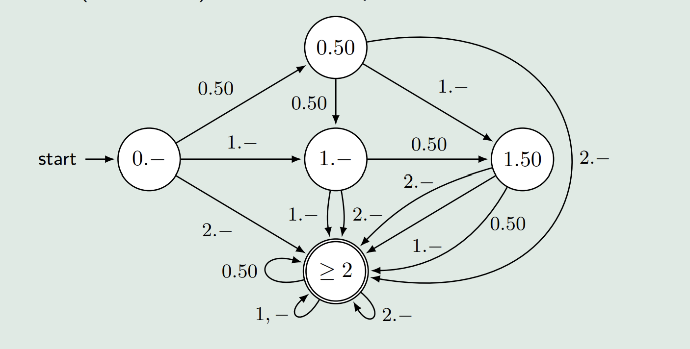

Ein **endlicher Automat** besteht aus (elementare Bausteine):

## Zuständen

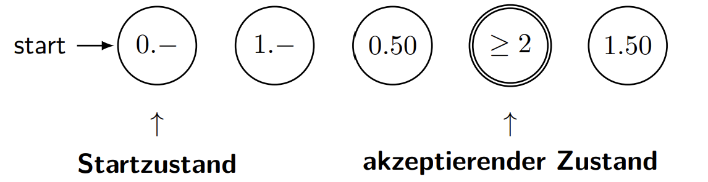

## Eingabealphabet

0.50, 1.-,2.-

## Übergangsfunktionen

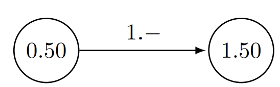

> Wie wird die Eingabe eingegeben?
> -> Der endliche Automat liest das Wort von links nach rechts

> Wieviel Speicher steht zur Verfügung? Wie geht man mit dem Speicher um?
> -> Es gibt keinen Speicher.
> -> Variablen dürfen nicht benutzt werden.
> -> Der einzige (gespeicherte) Information ist der aktuelle Zustand.

> Wie wird die Ausgabe bestimmt (und ausgegeben)?
> -> Die Ausgabe erfolgt über akzeptierende Zustände.

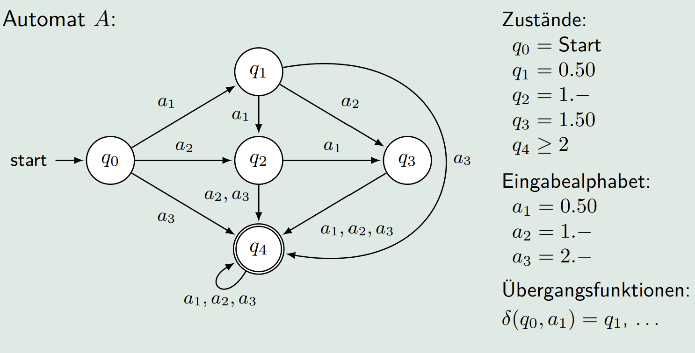

## Definition (Endlicher Automat)

Ein (deterministischer) endlicher Automat (EA) ist ein Quintupel

$$M=\left(Q, \Sigma, \delta, q_0, F\right)$$

- endlichen Menge von Zuständen $Q=\left\{q_0, q_1, \ldots, q_n\right\}(n \in \mathbb{N})$
- Eingabealphabet $\Sigma=\left\{a_1, a_2, \ldots, a_m\right\}(m \in \mathbb{N})$
- Übergangsfunktion $\delta: Q \times N \rightarrow Q$
- Startzustand $q_0 \in Q$
- Menge der akzeptierenden Zustände $F \subseteq Q$

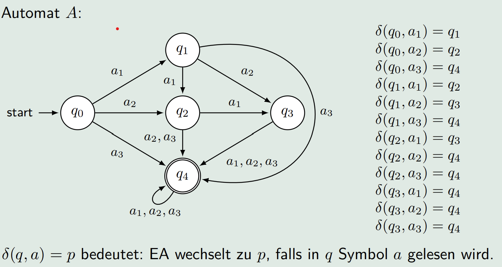

