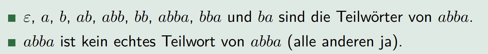

---
title:  'Theoretische Informatik'
author:
- Manuel Strenge
keywords: [TH, pain]
...

# Aplhabete

> **Mächtig was ist die Decke der Menge: Unendlich=sehr mächtig**

Ein Alphabet ist eine endliche, nichtleere Menge von Symbolen

{:),2} -> alphabet

{1,2,3} -> alphabet

{1,2,3,...} -> kein da nicht endlich

{a,...,b}  -> alphabet

{a,a,a}-> ja

# Wort

Ein Wort (Zeichenreihe, String) ist eine endliche Folge von Symbolen
eines bestimmten Alphabets

## Leeres Wort

Das **leere** Wort ist ein Wort, das keine Symbole enthält. Es wird durch
das Symbol $\varepsilon$ dargestellt und ist ein Wort über jedem Alphabet.

# Wörter

Die Länge eines Wortes $w$ ist die Länge des Wortes als Folge, also die
Anzahl der Symbole der Folge. Wir bezeichnen diese Länge mit $|w|$.

## Definition (Häufigkeit eines Symbols in einem Wort)

$|w|_{x}$ bezeichnet die absolute Häufigkeit eines Symbols $x$ in einem
Wortes $w$.

## Definition (Spiegelung eines Wort)

Mit $w^R$ wird das Spiegelwort zu $w$ bezeichnet.

$$w^{R} = (x_{1}, x_{2} . . . x_{n})^R = x_{n} . . . x_{2}, x_{1}$$

Es gilt $|w| = |w^{R}| und |w|_{x} = |w^{R}|_{x} für alle x \in \sum$. Wenn $w = w R$ gilt, dann bezeichnet man w als Palindrom.

## Definition (Teilwort)

Wir sagen, dass $v$ ein Teilwort (Infix) von $w$ ist, wenn man $w$ als

$$w=xvy$$

für beliebige Wörter $x$ und $y$ über $\sum$ schreiben kann

## Definition (echtes Teilwort)

Ein echtes Teilwort von $w$ ist jedes Teilwort von $w$, das nicht identisch
mit $w$ ist (in diesem Falle ist $x$ oder $y$ nicht leer).

In Programmiersprachen ist der Begriff substring gebräuchlich.

## Präfix

Ein Wort $v$ ist ein Präfix von $w$, wenn

$$w=xy$$

Ein echtes Präfix von w ist jedes Präfix von w, das nicht identisch mit w
ist (in diesem Fall ist y leer).

## Definition (Suffix)

Ein Wort v ist ein Suffix von w, wenn

$$w=xv$$

Ein echtes Suffix von w ist jedes Suffix von w, das nicht identisch mit w
ist (in diesem Fall ist x leer).

## Definition (Menge aller Wörter der Länge k)

Die Menge aller Wörter der Länge k über einem Alphabet $\sum$ wird mit
$\sum^{k}$ bezeichnet.

## Definition (Menge aller Wörter (Zeichenreihen))

Die Menge aller Wörter (Kleenesche Hülle) über einem Alphabet $\sum$
wird mit $\sum^{*}$ bezeichnet.
$\sum+ = \sum* \ {\varepsilon}$ ist die Menge aller nichtleeren Wörter (positive
Hülle) über einem Alphabet $\sum$.

> Regex definitionen ursprung von hier. 

### Eigenschaften

## Definition (Konkatenation)

Definition (Konkatenation) Seien $x$ und $y$ zwei beliebige Wörter. Dann steht

$x \circ y = xy := (x_{1}, x_{2} . . . x_{n}, y_{1}, y_{2} . . . y_{m})$

für die Konkatenation (Verkettung) von $x$ und $y$.

## Definition (Wortpotenzen)

Sei $x$ ein Wort über einem Alphabet $\sum$. Für alle $n \in N$ sind
Wortpotenzen wie folgt definiert:

## Definition (Sprache)

Eine Teilmenge $L \subseteq  \sum^{*}$ von Wörtern über einem Alphabet $\sum$ wird als Sprache über $\sum$ bezeichnet.

### Anmerkungen:
- Sprachen können aus unendlich vielen Wörtern bestehen.
- Wörter müssen aus einem festen, endlichen Alphabet gebildet werden.
- Wörter selber haben eine endliche Länge.

## Definition (Konkatenation von Sprachen)

Sind $A \subset \sum^{*}$ und $B \subset \tau^{*}$ beliebige Sprachen, dann wird die Menge

$$AB = {uv | u \in A und v \in B}$$

# Reguläre Ausdrücke

Reguläre Ausdrücke sind Wörter, die Sprachen beschreiben, also eine
Möglichkeit (gewisse) Sprachen endlich zu repräsentieren.

- Die Syntax der regulären Ausdrücke befasst sich mit der Frage, welche Form diese Wörter haben.
- In der Semantik der regulären Ausdrücke wird erklärt, wie man reguläre Ausdrücke als Sprachen interpretiert.

## Definition (Reguläre Ausdrücke)

Es sei $\sum$ ein beliebiges Alphabet. Die Sprache $RA \sum$ der regulären
Ausdrücke über $\sum$ ist wie folgt definiert:

## Erläuterungen zur Definition

- Die Sonderzeichen $\varepsilon$ und $\varnothing$ sind reguläre Ausdrücke.
- Jedes Symbol aus dem Alphabet $\sum$ ist auch ein regulärer Ausdruck über $\sum$.
- Ist $R$ ein regulärer Ausdruck über $\sum$, dann ist auch $(R^{*})$ ein regulärer Ausdruck über $\sum$.
- Sind $R$ und $S$ reguläre Ausdrücke über $\sum$, dann sind auch $(RS)$ und $(R|S)$ Ausdrücke über $\sum$.

# Eigenschaften und Konventionen:

# Reguläre Sprachen

## Satz (Rechenregeln für reguläre Ausdrücke)

- L(R|S) = L(S|R)
- L(R(ST)) = L((RS)T)
- L(R|(S|T)) = L((R|S)|T)
- L(R(S|T)) = L(RS|RT)
- L((R\*)\*) = L(R\*)
- L(R|R) = L(R)

## Anwendungen von regulären Ausdrücken:

- Mustersuche in Texten
- Lexikalische Analyse (in Compilern); Erkennung von Schlüsselwörtern (“Token”)
- Syntax Test (bei einer einfachen Syntax)

# Endliche Automaten

Beispiel (Einstiegsaufgabe: Eintrittskarte Schwimmbad)

> Kosten 2.- (mindestens), Automat akzeptiert 0.50, 1.- und 2.-

Ein **endlicher Automat** besteht aus (elementare Bausteine):

## Zuständen

## Eingabealphabet

0.50, 1.-,2.-

## Übergangsfunktionen

> Wie wird die Eingabe eingegeben?
> -> Der endliche Automat liest das Wort von links nach rechts

> Wieviel Speicher steht zur Verfügung? Wie geht man mit dem Speicher um?
> -> Es gibt keinen Speicher.
> -> Variablen dürfen nicht benutzt werden.
> -> Der einzige (gespeicherte) Information ist der aktuelle Zustand.

> Wie wird die Ausgabe bestimmt (und ausgegeben)?
> -> Die Ausgabe erfolgt über akzeptierende Zustände.

## Definition (Endlicher Automat)

Ein (deterministischer) endlicher Automat (EA) ist ein Quintupel

$$M=\left(Q, \Sigma, \delta, q_0, F\right)$$

- endlichen Menge von Zuständen $Q=\left\{q_0, q_1, \ldots, q_n\right\}(n \in \mathbb{N})$
- Eingabealphabet $\Sigma=\left\{a_1, a_2, \ldots, a_m\right\}(m \in \mathbb{N})$
- Übergangsfunktion $\delta: Q \times N \rightarrow Q$
- Startzustand $q_0 \in Q$
- Menge der akzeptierenden Zustände $F \subseteq Q$

##  Sind NEAs mächtiger als DEAs?

Es gibt einen DEA, der
die Sprache L akzeptiert.

vs

Es gibt einen NEA, der
die Sprache L akzeptiert.

Jeder DEA ist ein NEA.

Teilmengenkonstruktion (siehe nächste Folie)

### Beweiskonstruktion.

Sei $N=\left(Q_N, \Sigma, \delta_N, q_0, F_N\right)$ ein NEA

Der dazu äquivalente DEA $D=\left(Q_D, \Sigma, \delta_D, q_0, F_D\right)$ wird konstruiert
durch:
$$
Q_D=\mathcal{P}\left(Q_N\right)
$$
(Menge aller Teilmengen von $Q_N$ )

$$
F_D=\left\{S \in Q_D \mid S \cap F_N \neq \emptyset\right\}
$$
(alle Mengen aus $Q_D$, die mindestens einen akzeptierenden Zustand aus $F_N$ enthalten.)

$\delta_D(S, a)=\bigcup_{p \in S} \delta_N(p, a)$ für $S \in Q_D$ und $a \in \Sigma$
(Menge aller Zustände von $D$, die von den Zuständen aus $S$ durch
Lesen von $a$ erreichbar sind.)

## NEAs mit $\epsilon$ -Übergängen

Suche nach einem von mehreren Mustern:
$L_5=\left\{w \in\{a, b\}^* \mid w \text { enthält eines der Teilwörter } a b a, a b b, b a b\right\}$

Ein nichtdeterministischer endlicher Automat mit $\varepsilon$-Übergängen ($\varepsilon$-NEA) wird beschrieben durch

$$M=\left(Q, \Sigma, \delta, q_0, F\right)$$

wobei $Q, \Sigma, q_0$ und $F$ wie beim deterministischen endlichen Automaten definiert sind und die Übergangsfunktion $\delta$ definiert ist als.

$$\delta: Q \times(\Sigma \cup\{\varepsilon\}) \rightarrow \mathcal{P}(Q)$$

## Äquivalenz DEA und RA

Satz (Gleichmächtigkeit von RA und DEA)

Es gibt einen $D E A$, der
$\Longleftrightarrow$
Es gibt einen $R A$, der die die Sprache L akzeptiert. Sprache $L$ akzeptiert.

**Beweis**

- Dynamische Programmierung: Für jedes Paar von Zuständen p, q regulären Ausdrück finden, der alle Wörter beschreibt, die von p nach q führen.
- RA in einen speziellen NEA umwandeln, der auch spontane Übergänge (ohne ein Eingabesymbol zu lesen) zulässt. Diese sogenannten $\varepsilon$-NEAs können in NEAs und somit durch Teilmengenkonstruktion in DEAs umgewandelt werden.

Die Klasse der **regulären Sprachen** beinhaltet alle Sprachen, die von
einem endlichen Automaten akzeptier t werden.
Jede dieser Sprachen wird regulär genannt.

## Zustandsklassen

$$\text { Klasse }[p]=\left\{w \in \Sigma^* \mid M \text { endet nach dem Lesen von } w \text { in } p\right\}$$

Die Menge alle Wörter $\Sigma^*$ wird von den Zustandsklassen $\left[p_0\right]$ bis $\left[p_n\right]$ partitioniert.

## Eigenschaften der Klassen:

- Jedes Wort landet in einem Zustand:
$$\Sigma^*=\bigcup_{p \in Q}[p]$$

- Kein Wort landet nach dem Lesen in zwei Zuständen:
$$[p] \cap[q]=\emptyset, \text { für alle } p \neq q, p, q \in Q$$

- Von M akzeptierte Sprache:
$$L(M)=\bigcup_{p \in F}[p]$$

## Grenzen endlicher Automaten

Wenn ein EA $M$ nach dem Lesen zweier Präfixe $x$ und $y$ im gleichen Zustand landet, kann er nicht mehr zwischen $x$ und $y$ unterscheiden.

Sei $M=\left(Q, \Sigma, \delta, q_0, F\right)$ ein $E A$ und $x$ und $y$ zwei beliebige Wörter aus $\Sigma^*$, so dass $x, y \in[p]$. Dann gilt für alle Wörter $z \in \Sigma^*$
$$
x z \in L(M) \quad \Longleftrightarrow \quad y z \in L(M) .
$$

Endlichen Automaten definieren: 5 Tupel
Übergang skizieren zustände
Konfiguration eines Automaten; eine momentaufnahem zustand und rest des eingabewortes (Q0,aabba)
Berechnung start, rechnungsschritte...., endkonfiguration (erfolg oder nein)

# Kontextfreie Grammatiken

## Einführung und Definition
Kontextfreie Grammatik für die nicht-reguläre Sprache $\left\{0^n 1^n \mid n \in \mathbb{N}\right\}$

$$\begin{aligned}
& A \rightarrow 0 A 1 \\
& A \rightarrow \varepsilon
\end{aligned}$$

Eine Ableitung des Wortes 000111 in der Grammatik:

$A \Rightarrow 0 A 1 \Rightarrow 00 A 11 \Rightarrow 000 A 111 \Rightarrow 000111$

Eine kontextfreie Grammatik G (KFG) ist ein 4-Tupel $(N, \Sigma, P, A)$

- $N$ ist das Alphabet der Nichtterminale (Variablen)
- $\Sigma$ ist das Alphabet der Terminale.
- $P$ ist eine endliche Menge von Produktionen (Regeln). Jede Produktion hat die Form

$$
X \rightarrow \beta
$$

mit Kopf $X \in N$ und Rumpf $\beta \in(N \cup \Sigma)^*$.

- $A \text { ist das Startsymbol, wobei } A \in N \text {. }$

Definition (Satzform)
$\text { Ein Wort } \beta \in(N \cup \Sigma)^* \text { nennen wir Satzform. }$

## Ableitungsschritt, Ableitung

$\text { Seien } \alpha, \beta \text { und } \gamma \text { Satzformen und } A \rightarrow \gamma \text { eine Produktion. }$

Durch einen Ableitungsschritt wird eine Satzform $\alpha A \beta$ durch die Anwendung der Produktion $A \rightarrow \gamma$ in die Satzform $\alpha \gamma \beta$ abgeleitet.
Das notieren wir mit:
$$
\alpha A \beta \Rightarrow \alpha \gamma \beta
$$

Eine Ableitung ist eine Folge von Ableitungsschritten, so dass aus einer Satzform $\alpha$ das Wort $w$ abgeleitet wird.
$$
\alpha \Rightarrow \ldots \Rightarrow w
$$

Ein Wort $w \in \Sigma^*$ ist in einer kontextfreien Grammatik $G=(N, \Sigma, P, A)$ ableitbar, falls es eine Ableitung in $G$ gibt, die mit dem Startsymbol $A$ beginnt und mit dem Wort $w$ endet. Dafür schreiben wir
$$
A \stackrel{*}{\Rightarrow} w
$$
Wir sagen auch, dass $w$ von $A$ erzeugt oder generiert wird.

## Rechtseitige und linksseitige Ableitungen  

- Eine linksseitige Ableitung ersetzt bei jedem Ableitungsschritt das Nichtterminal, das am weitesten links in der Satzform auftritt 
- Eine rechtsseitige Ableitung ersetzt bei jedem Ableitungsschritt das Nichtterminal, das am weitesten rechts in der Satzform auftritt.

## Sprache eine KFG

Die von $G$ erzeugte Sprache $L(G)$ beinhaltet alle Wörter, die in $G$ aus dem Startsymbol $A$ ableitbar sind.
$$
L(G)=\left\{w \in \Sigma^* \mid A \stackrel{*}{\Rightarrow} w\right\}
$$

Wenn es für eine Sprache $L$ eine kontextfreie Grammatik $G$ gibt mit $L=L(G)$, dann nennen wir $L$ eine kontextfreie Sprache.

## Ableitungsbaum

Ein **Ableitungsbaum** ist eine graphische Darstellung einer Ableitung.
$\text { Beispiel (Ableitungsbaum für das Wort }(())() \text { in } G_2 \text { ) }$

## Mehrdeutigkeit (von KFG)
Beispiel (Kontextfreie Grammatik für einfache arithmetische Ausdrücke)

$$
G_3=\{\{A\},\{a, \cdot,+,(,)\}, P, A\}, \text { mit } P=\{A \rightarrow A+A|A \cdot A|(A) \mid a\}
$$
( $a$ steht vereinfachend für eine beliebige Binärzahl)

Definition (Mehrdeutige kontextfreie Grammatik)
> Eine kontextfreie Grammatik nennen wir mehrdeutig, wenn es ein Wort gibt, das mehrere Ableitungsbäume besitzt.

 
Definition (Inhärent mehrdeutig)

> Eine kontextfreie Sprache, für die alle Grammatiken mehrdeutig sind, heisst inhärent mehrdeutig.

Die kontextfreien Sprachen enthalten die regulären Sprachen.

## Zusammenhang von KFG und regulären Ausdrücken

Jede reguläre Sprache kann durch eine kontextfreie Grammatik beschrieben werden.
Sei $L$ eine reguläre Sprache. Dann gibt es einen DEA $M=\left(Q, \Sigma, \delta, q_0, F\right)$ mit $L(M)=L$
Dann können wir eine KFG für $L$ wie folgt bauen:
1 Für jeden Zustand $q_i$ gibt es ein Nichtterminal $Q_i$.
2 Für jede Transition $\delta\left(q_i, a\right)=q_j$ erstellen wir die Produktion $Q_i \rightarrow a Q_j$.
3 Für jeden akzeptierenden Zustand $q_i \in F$ erstellen wir die Produktion $Q_i \rightarrow \varepsilon$.
4 Das Nichtterminal $Q_0$ wird zum Startsymbol.

Techniken für den Entwurf von kontextfreien Grammatiken:

- Komplexe KFGs können oft in mehrere einfachere KFGs aufgeteilt werden und danach mit der Regel $A \rightarrow A_1\left|A_2\right| \ldots \mid A_k$ kombiniert werden.
- Um eine KFG für eine reguläre Sprache zu erstellen, kann zuerst ein DEA erstellt werden und dieser dann in eine KFG umgewandelt werden.
- Kontextfreie Sprachen enthalten manchmal Teilwörter, die voneinander „abhängig" sind. Eine KFG für diese Situation kann mit einer Regel $R \rightarrow u R v$ behandelt werden.
- Komplexere Sprachen sind meist rekursiv aufgebaut. Steht zum Beispiel das Nichtterminal $A$ für einen Ausdruck, kann $A$ wiederum überall dort verwendet werden, wo dieser Ausdruck erlaubt ist.

# Kellerautomaten

Funktioniert mit stack memory

Ein Kellerautomat für die kontextfreie Sprache $\left\{0^n 1^n \mid n>0\right\}$ :
- Solange keine Eins gelesen wird, lege die gelesenen Nullen auf dem Keller ab. Sobald Einsen gelesen werden, entferne für jede gelesene Eins eine Null vom Keller.
- Akzeptiere das Eingabewort, wenn die Berechnung im akzeptierenden Zustand endet. Der akzeptierende Zustand wird erreicht, wenn (der Keller leer ist und) das ganze Wort gelesen wurde.
- Andernfalls verwerfe die Eingabe.

## Definition (deterministischer Kellerautomat)

Ein deterministischer Kellerautomat (KA) $M$ ist ein 7-Tupel $\left(Q, \Sigma, \Gamma, \delta, q_0, \$, F\right)$, wobei
$Q$ ist eine endliche Menge von Zuständen.

- $\Sigma$ ist das Alphabet der Eingabe.
- $\Gamma$ ist das Alphabet des Kellers.
- $\delta: Q \times(\Sigma \cup \varepsilon) \times \Gamma \rightarrow Q \times \Gamma^*$ ist eine (partielle) Übergangsfunktion. $q_0 \in Q$ ist der Startzustand.
- $\$ \in \Gamma$ ist ein ausgezeichnetes Symbol vom Alphabet des Kellers.
- $F \subseteq Q$ ist die Menge der akzeptierenden Zustände.

Damit der Determinismus gewährleistet ist, gilt zusätzlich für die Übergangsfunktion $\delta$ :
Wenn ein Übergang $\delta(q, b, x)$, mit $q \in Q, b \in \Sigma, x \in \Gamma$, existiert, dann darf nicht (gleichzeitig) der Übergang $\delta(q, \varepsilon, x)$ vorkommen.

Formal: Für jeden Zustand $q$ und alle Symbole $x, b$ gilt, wenn $\delta(q, b, x)$ definiert ist, dann ist $\delta(q, \varepsilon, x)$ undefiniert.

## Berechnungsschritte

Ein Berechnungsschritt $\delta(q, b, c)=(p, w)$ wird wie folgt interpretiert:
1. Der Automat befindet sich im Zustand $q$.
2. Der Automat liest das Symbol $b$ von der Eingabe (falls $b=\varepsilon$, wird nichts gelesen).
3. Der Automat entfernt das oberste Kellersymbol $c$.
4. Der Automat schreibt das Wort $w$ auf den Stack (von hinten nach vorne).
5. Der Automat wechselt in den Zustand $p$.

$$\text { Ein Übergang } \delta(q, b, c)=(p, w) \text { wird graphisch als }$$

Analog zu den endlichen Zustandsautomaten gelten folgende Konventionen:
- Akzeptierende Zustände werden mit einer doppelten Konturlinie gekennzeichnet.
- Der Anfangszustand wird durch einen eingehenden Pfeil gekennzeichnet.

## Definition (nichtdeterministischer Kellerautomat)

Ein nichtdeterministischer Kellerautomat (NKA) ist ein 7-Tupel $\left(Q, \Sigma, \Gamma, \delta, q_0, \$, F\right)$, der sich vom KA nur in der Definition der Übergangsfunktion unterscheidet:
$$
\delta: Q \times(\Sigma \cup \varepsilon) \times \Gamma \rightarrow \mathcal{P}\left(Q \times \Gamma^*\right)
$$

## Definition (Konfiguration)

Sei $M=\left(Q, \Sigma, \Gamma, \delta, q_0, \$, F\right)$ ein NKA.
Eine Konfiguration von $M$ ist ein Element $(q, w, \gamma)$ aus $Q \times \Sigma^* \times \Gamma^*$, wobei
$q$ für den Zustand steht,
$w$ die verbleibende Eingabe repräsentiert,
$\gamma$ für den Inhalt des Kellers steht.
(Dabei steht das Symbol ganz links für das oberste Symbol.)
Mit $\left(q_o, w, \$\right)$ bezeichnen wir die Startkonfiguration für die Eingabe $w$ und mit $(q, \varepsilon, \gamma)$ eine Endkonfiguration.

## Definition (Berechnung)

Sei $M=\left(Q, \Sigma, \Gamma, \delta, q_0, \$, F\right)$ ein NKA. Seien $w \in \Sigma^*$ und $\gamma \in \Gamma^*$.
Eine Berechnung von $M$ auf $w$ ist:
eine Folge von Berechnungsschritten,
die in der Startkonfiguration beginnt und
in einer Endkonfiguration $\left(q_f, \varepsilon, \gamma\right)$ endet, von der aus kein weiterer Berechnungsschritt mehr möglich ist.

Die Berechnung ist akzeptierend, wenn für die Endkonfiguration $\left(q_f, \varepsilon, \gamma\right)$ gilt, dass $q_f \in F$

## Definition (Sprache L(M))

Sei $M=\left(Q, \Sigma, \Gamma, \delta, q_0, \$, F\right)$ ein NKA.
Die Sprache $L(M)$ des Kellerautomaten $M$ ist definiert durch $L(M)=\left\{w \in \Sigma^* \mid\left(q_0, w, \$\right) \vdash^*(q, \varepsilon, \gamma)\right.$ für ein $q \in F$ und ein $\left.\gamma \in \Gamma^*\right\}$.
Elemente von $L(M)$ werden (von $M$ ) akzeptierte Wörter genannt.

## Äquivalenz mit kontextfreien Grammatiken

Eine Sprache ist kontextfrei, genau dann, wenn es einen
nichtdeterministischen Kellerautomaten gibt, der die Sprache erkennt.

# Turing Machine

Eine (deterministische) Turing-Maschine (TM) ist ein 7-Tupel
$$
M=\left(Q, \Sigma, \Gamma, \delta, q_0, \sqcup, F\right)
$$
mit einer bzw. einem: 

endlichen Menge von Zuständen $Q=\left\{q_0, q_1, \ldots, q_n\right\}(n \in \mathbb{N})$,

- Eingabealphabet $\Sigma=\left\{a_1, a_2, \ldots, a_m\right\}(m \in \mathbb{N})$,
- Übergangsfunktion $\delta: Q \times \Gamma \rightarrow Q \times \Gamma \times D, D=\{L, R\}$,
- Startzustand $q_0 \in Q$,
- Menge von akzeptierenden Zuständen $F \subseteq Q$,
- Bandalphabet $\Gamma$ (endliche Menge von Symbolen) und $\Sigma \subset \Gamma$ und
- Leerzeichen $_{\sqcup}$, mit $\lrcorner \in \Gamma$ und $\lrcorner \notin \Sigma$.

Die Übergangsfunktion $\delta$ ist eine partielle Funktion
$$
\delta: Q \times \Gamma \rightarrow Q \times \Gamma \times D .
$$
Sie bildet das 2-Tupel $(q, X)$ auf das Tripel $(p, Y, D)$ ab:
$q, p \in Q$ und $X, Y \in \Gamma$
- $D$ beschreibt die Bewegung des Lese-/Schreibkopfes über dem Band. $D$ kann die Werte $L$ für links (bzw. left) und $R$ für rechts (bzw. right) annehmen.

Das Band
ist in einzelne Zellen unterteilt, die jeweils ein beliebiges Symbol aus $\Gamma$ enthalten können, und
beinhaltet zu Beginn die Eingabe, d. h. ein endliches Wort aus $\Sigma^*$. Alle anderen Zellen enthalten das besondere Symbol $\sqcup^2$.

Der Lese-/Schreibkopf kann jeweils genau eine Zelle des Bandes lesen und beschreiben.

## Maschinen mit meheren Stacks

$\text { Maschine mit mehreren Stacks ( } k \text {-Stack-Maschine) }$

$\text { Eine } k \text {-Stack-Maschine ist ein DKA mit } k \text { statt nur einem Stack. }$

> Jede Sprache L, die von einer TM T akzeptiert wird, wird auch von einer
> Zähler-Maschine Z mit 2 Zählern akzeptiert.

a) Ein 2-Stack-Maschine kann eine TM simulieren.
b) Eine Zählermaschine mit 3 Zählern kann eine 2-Stack-Maschine simulieren.
c) Eine Zählermaschine mit 2 Zählern kann eine Zählermaschine mit 3 Zählern simulieren.

1 1 1 1 10 10 1 10 1 100 10 1 1 1 1 100 10 100 10 1000 1 10 1 1 1 100000 10000 1 1000 1 1 1 100 10 10 100 1 100

18509430403077407630668
